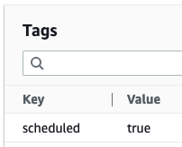
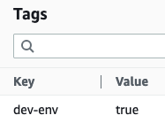

# Simple EC2 Instance Scheduler

This simple solution deploys two AWS Lambda functions that will start and stop the Amazon EC2 instances of your choice by adding a specific tag. For this purpose, two Amazon EventBridge rules are created:

* One rule will execute the AWS Lambda function that will START all your tagged instances at 08:00 AM (CST) from Monday to Friday.
* The second rule will execute the AWS Lambda function that will STOP all your tagged instances at 20:00 (CST) from Monday to Friday.

These rules can be enabled or disabled at any time directly in the Amazon EventBridge service. You can also modify the time, date and frequency of execution of these rules in Amazon EventBridge and adjust these to your convenience. See the "Outputs" section in AWS CloudFormation for the name of the Amazon EventBridge rules.

You can use this solution with those environments that are not required to be on 24/7 (e.g.: dev and test) and save money.

## Instructions

1. Deploy the AWS CloudFormation template.
2. Once the resources are deployed, start tagging the Amazon EC2 instances that you want to start and stop automatically. Default tag is:

* Key = scheduled
* Value = true

You are set.

If you need to start/stop different Amazon EC2 instances at different times, you can deploy this template several times specifying different tags for each use case (e.g.: use the tag dev-env/true for the dev environment instances or the tag test-env/true for the test environment instances). Make sure to modify the Amazon EventBridge rules accordingly.

